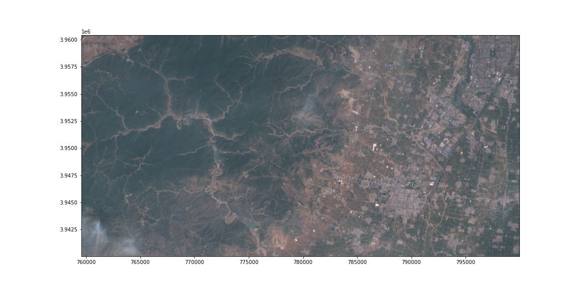

# georeader

Package to read data from rasters with very few dependencies, compatible with cloud platforms and with lazy loading.

## Install

```bash
git clone 
cd georeader
pip install -e .
```

This package is work in progress. The API might change without notice. Use it with caution.

## Getting started

```python
import os

os.environ["GOOGLE_APPLICATION_CREDENTIALS"] = "/path/to/requester/pays/credentials.json"
os.environ["GS_USER_PROJECT"] = "project-name-to-bill"

from georeader.readers import S2_SAFE_reader
from georeader import read

bounds_read = (759760.0, 3940220.0, 799760.0, 3960220.0)
crs_bounds = "EPSG:32649"
s2obj = S2_SAFE_reader.s2loader("gs://gcp-public-data-sentinel-2/tiles/13/S/ER/S2B_MSIL1C_20191008T173219_N0208_R055_T13SER_20191008T204555.SAFE", 
                                out_res=10, bands=["B04","B03","B02"])

data = read.read_from_bounds(s2obj, bounds_read, crs_bounds=crs_bounds, 
                             pad_add=(20,20))

data_memory = data.load()

data_memory

    Transform: | 10.00, 0.00, 759560.00|
               | 0.00,-10.00, 3960420.00|
               | 0.00, 0.00, 1.00|
    Shape: (3, 2040, 4040)
    Resolution: (10.0, 10.0)
    Bounds: (759560.0, 3940020.0, 799960.0, 3960420.0)
    CRS: EPSG:32649
    fill_value_default: 0

from rasterio.plot import  show
show((data_memory.values-1000)/3500, transform=data_memory.transform)
```


```python
# Save the data
from georeader.save_cog import save_cog

# Supports writing in bucket location (gs://bucket-name/s2_crop.tif)
save_cog(data_memory, "s2_crop.tif", descriptions=s2obj.bands)
```

## Tutorials

* [Tutorial to read overlapping tiles from a GeoTIFF and Sentinel-2 images](https://github.com/spaceml-org/georeader/blob/main/notebooks/reading_overlapping_sentinel2_aviris.ipynb)
* [Example of reading Proba-V images overlapping with Sentinel-2](https://github.com/spaceml-org/georeader/blob/main/notebooks/read_overlapping_probav_and_sentinel2.ipynb)
* [Reading Sentinel-2 images from the public Google bucket](https://github.com/spaceml-org/georeader/blob/main/notebooks/read_S2_SAFE_from_bucket.ipynb)
* [Query Sentinel-2 images over a location and time period and plot them](https://github.com/spaceml-org/georeader/blob/main/notebooks/Sentinel-2/query_s2_images.ipynb)


## TODOs
 * Fix and run tests.
 * Finish `xarray` wrapper (cast function) (finish `GeoDataArray` class)
 * `GeoTensor.resize` with `kornia` if inner tensor is a `torch.Tensor`.

## Potential features

* `read_tile` function + example of serving images.
* Add `matplotlib` plotting functions.
* Readers of standard format for Landsat-8? Read from s3 Landsat bucket?

## Examples

* Tutorial basic usage
* Show MISR dataset
* Example of serving images
* Example of building a torch Dataset


