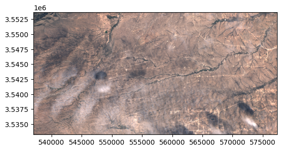

# georeader

Read data from rasters: very few dependencies, compatible with cloud platforms and lazy loading.

## Install

```bash
# Install with minimal requirements (only rasterio, numpy as shapely)
pip install git+https://github.com/spaceml-org/georeader#egg=georeader

# Install with Google dependencies (to read objects from Google Cloud Storage or Google Earth Engine)
pip install git+https://github.com/spaceml-org/georeader#egg=georeader[google]

# Install with Planetary Computer requirements
pip install git+https://github.com/spaceml-org/georeader#egg=georeader[microsoftplanetary]
```

This package is work in progress. The API might change without notice. Use it with caution.

## Getting started

```python
# This snippet requires Google requirements:
# pip install git+https://github.com/spaceml-org/georeader#egg=georeader[google]
import os

os.environ["GOOGLE_APPLICATION_CREDENTIALS"] = "/path/to/requester/pays/credentials.json"
os.environ["GS_USER_PROJECT"] = "project-name-to-bill"

from georeader.readers import S2_SAFE_reader
from georeader import read

cords_read = (-104.394, 32.026) # long, lat
crs_cords = "EPSG:4326"
s2obj = S2_SAFE_reader.s2loader("gs://gcp-public-data-sentinel-2/tiles/13/S/ER/S2B_MSIL1C_20191008T173219_N0208_R055_T13SER_20191008T204555.SAFE", 
                                out_res=10, bands=["B04","B03","B02"])

data = read.read_from_center_coords(s2obj,cords_read, shape=(2040, 4040),
                                    crs_center_coords=crs_cords)

# See also read.read_from_bounds, read.read_from_polygon

data_memory = data.load() # this triggers downloading the data

data_memory # GeoTensor object

```
```
>>  Transform: | 10.00, 0.00, 537020.00|
| 0.00,-10.00, 3553680.00|
| 0.00, 0.00, 1.00|
         Shape: (3, 2040, 4040)
         Resolution: (10.0, 10.0)
         Bounds: (537020.0, 3533280.0, 577420.0, 3553680.0)
         CRS: EPSG:32613
         fill_value_default: 0
```

In the `.values` attribute we have the plain numpy array that we can plot with `show`:

```python
from rasterio.plot import  show
show(data_memory.values/3500, transform=data_memory.transform)

```


Saving the `GeoTensor` as a COG GeoTIFF: 

```python
from georeader.save import save_cog

# Supports writing in bucket location (e.g. gs://bucket-name/s2_crop.tif)
save_cog(data_memory, "s2_crop.tif", descriptions=s2obj.bands)
```

## Tutorials

* [Tutorial to read overlapping tiles from a GeoTIFF and a Sentinel-2 image](https://github.com/spaceml-org/georeader/blob/main/notebooks/reading_overlapping_sentinel2_aviris.ipynb)
* [Example of reading a Proba-V image overlapping with Sentinel-2 forcing same resolution](https://github.com/spaceml-org/georeader/blob/main/notebooks/read_overlapping_probav_and_sentinel2.ipynb)
* [Reading Sentinel-2 images from the public Google bucket](https://github.com/spaceml-org/georeader/blob/main/notebooks/read_S2_SAFE_from_bucket.ipynb)
* [Query Sentinel-2 images over a location and time span, mosaic and plot them](https://github.com/spaceml-org/georeader/blob/main/notebooks/Sentinel-2/query_mosaic_s2_images.ipynb)

