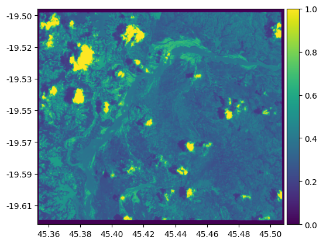
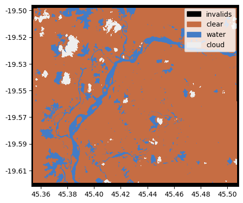
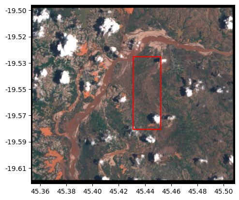

# Plotting Functions

The `georeader.plot` module provides `matplotlib` visualization functions for working with geospatial data, particularly with `GeoTensor` objects. These functions build on `matplotlib` to provide convenient ways to visualize raster data with appropriate geographic context.


## `plot.show`

This function displays geospatial data on a matplotlib axis. It's a wrapper around matplotlib's `imshow` function that handles GeoData objects properly, respecting their coordinate systems.

**Features:**
* Automatically handles the extent based on the data's bounds
* Optional colorbar display
* Optional scale bar showing geographic scale
* Can display coordinates in lat/long format
* Handles masking of no-data values

**Example:**
```python
import matplotlib.pyplot as plt
from georeader import plot

# Display RGB data (3-band image)
rgb = (s2img[[3,2,1]] / 3_500).clip(0,1)
plot.show(rgb)
```


```python
# With colorbar
greyimg = np.mean(rgb, axis=0)
plot.show(greyimg, add_colorbar_next_to=True)
```



## `plot.plot_segmentation_mask`

This function visualizes discrete segmentation masks (like land cover classifications) with appropriate colors and legend.

**Features:**
* Customizable color mapping for different classes
* Optional legend with class names
* Works with both numeric and categorical data

**Example:**
```python
# Create a land/water/cloud mask
water = mndwi < 0
land_water_clouds = GeoTensor(np.ones(clouds.shape, dtype=np.uint8),
                              fill_value_default=0,
                              crs=clouds.crs,
                              transform=clouds.transform)

land_water_clouds[water] = 2
land_water_clouds[clouds] = 3
land_water_clouds[invalids] = 0

plot.plot_segmentation_mask(land_water_clouds, 
                           interpretation_array=["invalids","clear","water","cloud"], 
                           color_array=["#000000","#c66d43","#437cc6","#eeeeee"])
```



## `plot.add_shape_to_plot`

This function adds vector data (like points, lines, polygons) to an existing map.

**Features:**
* Works with GeoDataFrame, individual geometries, or lists of geometries
* Handles coordinate system transformations
* Customizable styling options
* Can plot polygon outlines only

**Example:**
```python
from georeader import plot
from shapely.geometry import box

# Create a plot with raster data
ax = plot.show(rgb)
bbox = box(45.43, -19.53, 45.45, -19.58)

plot.add_shape_to_plot(bbox, ax=ax, polygon_no_fill=True, 
                       crs_plot=rgb.crs,
                       crs_shape="EPSG:4326",
                       kwargs_geopandas_plot={"color": "red"})
```



## API Reference

::: georeader.plot
    options:
      members:
        - show
        - plot_segmentation_mask
        - add_shape_to_plot
